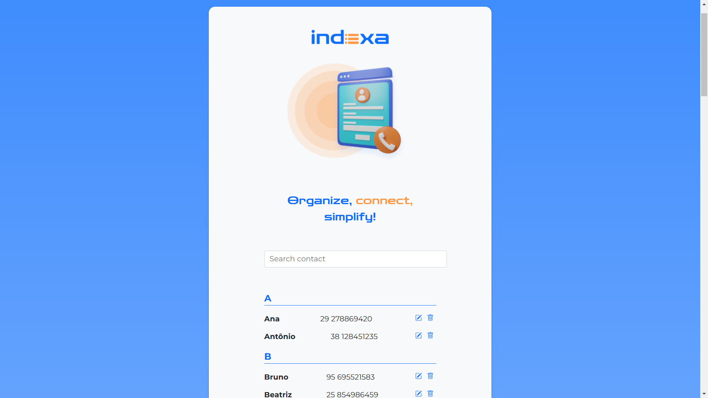

Indexa is a simple contact management web application built with Angular CLI 19.1.8. This project was developed as part of a course from [Alura](https://www.alura.com.br/) to stay up to date with the latest version of Angular.

  
*Initial screen of the Indexa application*

## Features
- View contact list 
- Filter contacts by text
- Future support for adding, editing, and deleting contacts  
- Native CSS styling without external frameworks  

## Installation

### Prerequisites  
Ensure you have the following installed:  
- [Node.js](https://nodejs.org/) (LTS version recommended)  
- [Angular CLI](https://angular.io/cli)  

### Setup  

To ensure compatibility, install the specific version of Angular CLI:  
```sh
npm install -g @angular/cli@19.1.8
```
Clone this repository and then install dependencies:  
   ```sh
   npm install
   ```
Run the application:  
   ```sh
   ng serve
   ```
Open in the browser:  
   ```
   http://localhost:4200
   ```

### Project Structure  
```
indexa/
│-- src/
│   │-- app/
│   │   │-- components/
│   │   │   │-- header/
│   │   │   │-- contact/
│   │   │   │-- container/
│   │   │   │-- separator/
│   │   │-- models/
│   │   │-- contacts.json
│   │-- assets/
│   │-- styles.css
│   │-- index.html
│   │-- main.ts
```
